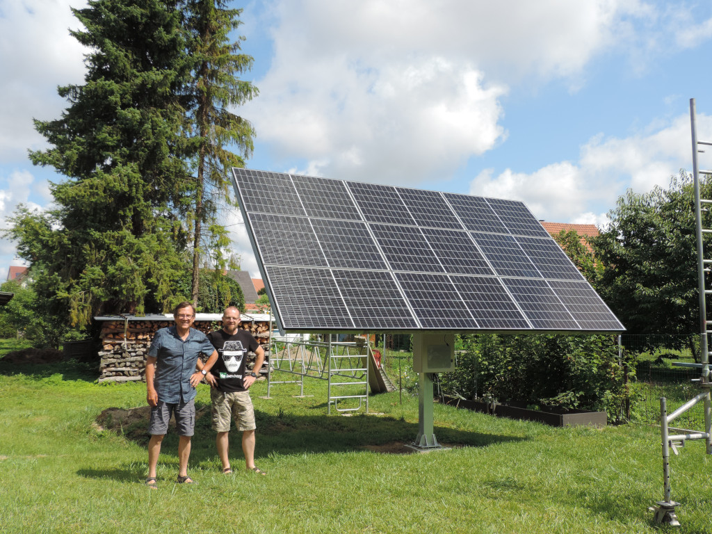
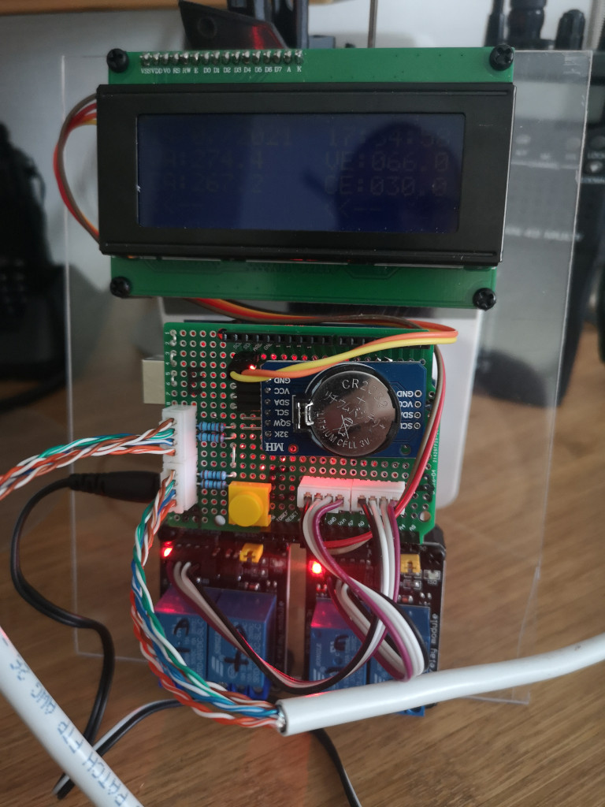

## Solar panel position control

## Orient a solar panel optimally in relation to the position of the sun

### Principle
We seek to orient the solar panel in relation to the sun in order to optimize its performance.
Throughout the day, the position of the panel is compared with a setpoint table, and if there is a difference, the motor(s) are operated so that the panel comes to the desired position.

- A motor on each axis with start and end limit switches directly on the motor (not managed in the program)
- An encoder on each axis to measure the relative position in degrees compared to the initial position
- The measurements are compared to a table of variable setpoints according to the month and the hour
- In elevation, if the measurement is different from the setpoint, the motor is activated in one direction or the other
- In azimuth, if the measurement is less than the setpoint, the motor is activated clockwise
- Initialization of the position daily at a fixed time

### Components
- The system is managed by an Arduino.
- The motors are operated via relays.
- The position is read with incremental sensors installed on the panel rotation axes.
- Date and time management is entrusted to a DS3231 module.
- An LCD screen displays the date and time, the setpoint, the position, and the status of the motors.
- A serial link allows some interaction with the system.

### Licence
Published under [MIT license](license.txt)
